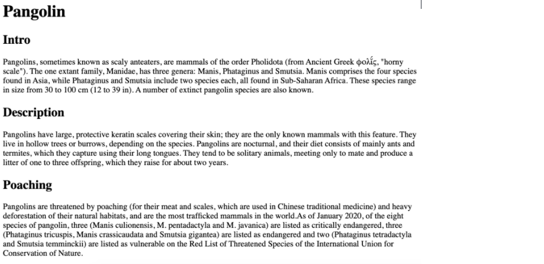
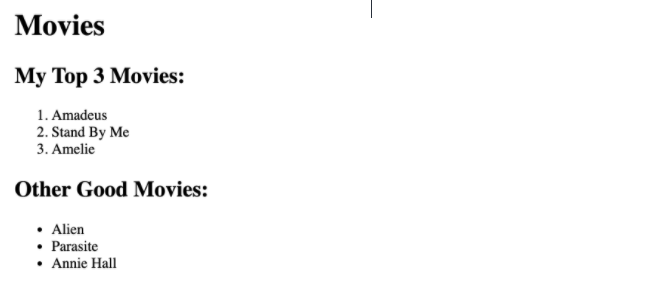

## Coding Exercise 1: Pangolin Practice
Let's get a little bit of practice with **index.html** file, you'll find some starter text.  Please add in the appropriate paragraph and heading elements to recreate what is shown in this image:


### Given Code Templetes:<br>

*index.html*

``` Pangolin

Intro

Pangolins, sometimes known as scaly anteaters, are mammals of the order Pholidota (from Ancient Greek φολῐ́ς, "horny scale"). The one extant family, Manidae, has three genera: Manis, Phataginus and Smutsia. Manis comprises the four species found in Asia, while Phataginus and Smutsia include two species each, all found in Sub-Saharan Africa. These species range in size from 30 to 100 cm (12 to 39 in). A number of extinct pangolin species are also known.

Description

Pangolins have large, protective keratin scales covering their skin; they are the only known mammals with this feature. They live in hollow trees or burrows, depending on the species. Pangolins are nocturnal, and their diet consists of mainly ants and termites, which they capture using their long tongues. They tend to be solitary animals, meeting only to mate and produce a litter of one to three offspring, which they raise for about two years.

Poaching

Pangolins are threatened by poaching (for their meat and scales, which are used in Chinese traditional medicine) and heavy deforestation of their natural habitats, and are the most trafficked mammals in the world.As of January 2020, of the eight species of pangolin, three (Manis culionensis, M. pentadactyla and M. javanica) are listed as critically endangered, three (Phataginus tricuspis, Manis crassicaudata and Smutsia gigantea) are listed as endangered and two (Phataginus tetradactyla and Smutsia temminckii) are listed as vulnerable on the Red List of Threatened Species of the International Union for Conservation of Nature.

```

## Coding Exercise 2: Favorite Movies Exercises
It's time to practice working with **ordered and unordered lists** . In the index.html file, you will find some existing markup.  Please add on to the markup to recreate the two lists in the following image. 

### Given Code Templetes:<br>

*index.html*
```
<h1>Movies</h1>
<h2>My Top 3 Movies:</h2>

Amadeus
Stand By Me
Amelie


<h2>Other Good Movies:</h2>

Alien
Parasite
Annie Hall
```
## Coding Exercise 3: Wolf Images & Links Exercise
Let's get some practice with HTML Images and Anchor Elements.  In **index.html** , please do the following:<ul><li><p>Create a link that goes to this url: <strong>https://en.wikipedia.org/wiki/Wolf</strong> Use whatever link text you would like!</p></li><li><p>Create an image element using this source: <strong>https://upload.wikimedia.org/wikipedia/commons/5/5f/Kolm%C3%A5rden_Wolf.jpg</strong></p></li><li><p>Make sure to include some alt text on the image!</p></li></ul>

### Given Code Templetes:<br>

*index.html*
```
<!-- A blank page...Don't worry you got this! -->
<!-- link: https://en.wikipedia.org/wiki/Wolf -->
<!-- image: https://upload.wikimedia.org/wikipedia/commons/5/5f/Kolm%C3%A5rden_Wolf.jpg -->
```
## Coding Exercise 4: Snowman Logo Exercise
<p>It's time for more practice!&nbsp; Please write an <code>&lt;h1&gt;</code> element to recreate the following image:</p>

<ul><li><p>There is a <code><em>snowman</em></code> entity code.&nbsp; Find it! (you will need to google it)</p></li><li><p>Use the <code><em>registered trademark</em></code> entity code (the circled R at the end) , AND be sure to make it <strong>superscript</strong></p></li></ul>
<p><strong>Note: No one expects you to memorize any of the entity codes.&nbsp; Get used to googling them! It's normal!</strong></p>

### Given Code Templetes:<br>
*index.html*
```
<!--Write Your Code In Here!-->
```


