## Coding Exercise 1: Pangolin Practice
Let's get a little bit of practice with **index.html** file, you'll find some starter text.  Please add in the appropriate paragraph and heading elements to recreate what is shown in this image:
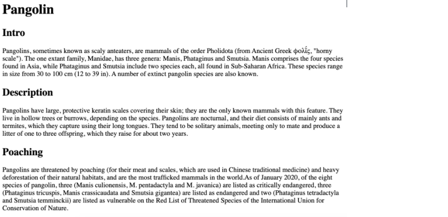

### Given Code Templetes:<br>

*index.html*

``` Pangolin

Intro

Pangolins, sometimes known as scaly anteaters, are mammals of the order Pholidota (from Ancient Greek φολῐ́ς, "horny scale"). The one extant family, Manidae, has three genera: Manis, Phataginus and Smutsia. Manis comprises the four species found in Asia, while Phataginus and Smutsia include two species each, all found in Sub-Saharan Africa. These species range in size from 30 to 100 cm (12 to 39 in). A number of extinct pangolin species are also known.

Description

Pangolins have large, protective keratin scales covering their skin; they are the only known mammals with this feature. They live in hollow trees or burrows, depending on the species. Pangolins are nocturnal, and their diet consists of mainly ants and termites, which they capture using their long tongues. They tend to be solitary animals, meeting only to mate and produce a litter of one to three offspring, which they raise for about two years.

Poaching

Pangolins are threatened by poaching (for their meat and scales, which are used in Chinese traditional medicine) and heavy deforestation of their natural habitats, and are the most trafficked mammals in the world.As of January 2020, of the eight species of pangolin, three (Manis culionensis, M. pentadactyla and M. javanica) are listed as critically endangered, three (Phataginus tricuspis, Manis crassicaudata and Smutsia gigantea) are listed as endangered and two (Phataginus tetradactyla and Smutsia temminckii) are listed as vulnerable on the Red List of Threatened Species of the International Union for Conservation of Nature.

```

## Coding Exercise 2: Favorite Movies Exercises
It's time to practice working with **ordered and unordered lists** . In the index.html file, you will find some existing markup.  Please add on to the markup to recreate the two lists in the following image. 
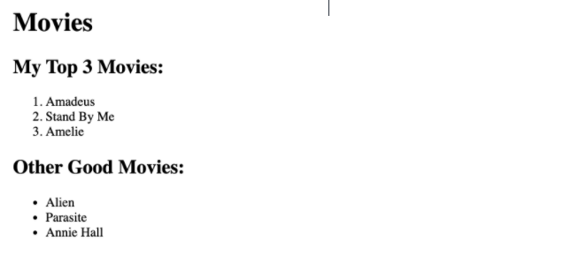
### Given Code Templetes:<br>

*index.html*
```
<h1>Movies</h1>
<h2>My Top 3 Movies:</h2>

Amadeus
Stand By Me
Amelie


<h2>Other Good Movies:</h2>

Alien
Parasite
Annie Hall
```
## Coding Exercise 3: Wolf Images & Links Exercise
Let's get some practice with HTML Images and Anchor Elements.  In **index.html** , please do the following:<ul><li><p>Create a link that goes to this url: <strong>https://en.wikipedia.org/wiki/Wolf</strong> Use whatever link text you would like!</p></li><li><p>Create an image element using this source: <strong>https://upload.wikimedia.org/wikipedia/commons/5/5f/Kolm%C3%A5rden_Wolf.jpg</strong></p></li><li><p>Make sure to include some alt text on the image!</p></li></ul>

### Given Code Templetes:<br>

*index.html*
```
<!-- A blank page...Don't worry you got this! -->
<!-- link: https://en.wikipedia.org/wiki/Wolf -->
<!-- image: https://upload.wikimedia.org/wikipedia/commons/5/5f/Kolm%C3%A5rden_Wolf.jpg -->
```
## Coding Exercise 4: Snowman Logo Exercise
<p>It's time for more practice!&nbsp; Please write an <code>&lt;h1&gt;</code> element to recreate the following image:</p>


<ul><li><p>There is a <code><em>snowman</em></code> entity code.&nbsp; Find it! (you will need to google it)</p></li><li><p>Use the <code><em>registered trademark</em></code> entity code (the circled R at the end) , AND be sure to make it <strong>superscript</strong></p></li></ul>
<p><strong>Note: No one expects you to memorize any of the entity codes.&nbsp; Get used to googling them! It's normal!</strong></p>

### Given Code Templetes:<br>
*index.html*
```
<!--Write Your Code In Here!-->
```

## Coding Exercise 5: Table Practice Exercise

<p>It's time to get some practice with all those table-related elements! (yikes)&nbsp; Your goal is to create a 3x3 table, with proper headings. (so it's really 4x3 if you count the heading cells)&nbsp; I've provided you with some starter data in <code>index.html</code>, though you do not have to use it.&nbsp; Just make sure you create a 3x3 table with a row of headings at the top, using the correct semantic elements. You are expected to use the following elements: <code>table</code>, <code>thead</code>, <code>tr</code>, <code>th</code>, <code>tbody</code>, and <code>td</code></p>
<p>Here is what the table would look like with the starter data provided in index.html:</p>

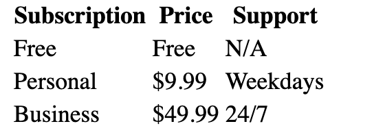

### Given Code Templetes:<br>
*index.html*
```
<!-- You can use your own content, or use the following to help get started -->
<!--  just make sure to use the same number of data points -->

Subscription | Price | Support 
Free | Free | N/A 
Personal | $9.99 | Weekdays 
Business | $49.99 | 24/7 
```

### Coding Exercise 6: Forms Practice Exercise

<p>Let's get some practice with forms, inputs, labels, and buttons! Write a simple form with the following inputs:</p>

<ol><li><p>Username</p><ol><li><p>Text Input</p></li><li><p>Should have placeholder text of 'username'</p></li><li><p>Make sure to properly label the input (using id/for attributes)</p></li></ol></li><li><p>Password</p><ol><li><p>Password Input</p></li><li><p>Should have placeholder text of 'password'</p></li><li><p>Make sure to properly label the input (using id/for attributes)</p></li></ol></li><li><p>A Button</p><ol><li><p>With the inner text 'Register'</p></li></ol></li></ol>
<p><strong>I added in some &lt;div&gt; elements for spacing, but you don't need to:</strong></p>

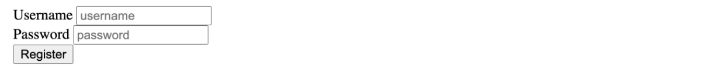

### Given Code Templetes:<br>
*index.html*
```
<!DOCTYPE html>
<html lang="en">

<head>
    <meta charset="UTF-8">
    <meta http-equiv="X-UA-Compatible" content="IE=edge">
    <meta name="viewport" content="width=device-width, initial-scale=1.0">
    <title>Document</title>
</head>

<body>
    <form action="">
        <div>
            <label for="username">Username</label>
            <input type="text" name="username" id="username" placeholder="username">
        </div>
        <div>
            <label for="password">Password</label>
            <input type="password" name="password" id="password" placeholder="password">
        </div>
        <div>
            <button>Register</button>
        </div>
    </form>
</body>

</html>
```
### Coding Exercise 7: Our First CSS Exercise
<p>Time for some basic CSS&nbsp;practice! I've provided you with some basic HTML markup in index.html, please don't touch it!&nbsp; I've also made a <code>styles.css</code> file for you to work in.&nbsp; Please style the elements according to these rules:</p>

<div class="ud-component--base-components--code-block"><div><pre class="prettyprint linenums prettyprinted" role="presentation" style=""><ol class="linenums"><li class="L0"><span class="pln">h1s</span></li><li class="L1"><span class="pln">     </span><span class="pun">-</span><span class="pln"> green text</span></li><li class="L2"><span class="pln">h2s</span></li><li class="L3"><span class="pln">     </span><span class="pun">-</span><span class="pln"> magenta text</span></li><li class="L4"><span class="pln">paragraphs</span></li><li class="L5"><span class="pln">    </span><span class="pun">-</span><span class="pln"> white text</span></li><li class="L6"><span class="pln">    </span><span class="pun">-</span><span class="pln"> black background color</span></li><li class="L7"><span class="pln">buttons</span></li><li class="L8"><span class="pln">    </span><span class="pun">-</span><span class="pln"> red text</span></li><li class="L9"><span class="pln">    </span><span class="pun">-</span><span class="pln"> pink background color</span></li></ol></pre></div></div>
<p>If done correctly, you'll see this stunningly beautiful result:</p>

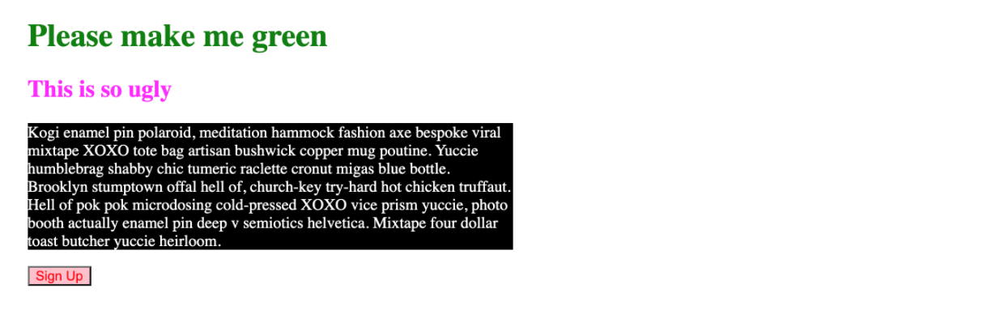

### Given Code Templetes:<br>
*index.html*
```
<!DOCTYPE html>
<html lang="en">
<head>
  <title>Hey!</title>
  <link href="styles.css">
</head>
<body>
  <h1>Please make me green</h1>
  <h2>This is so ugly</h2>
  <p>Kogi enamel pin polaroid, meditation hammock fashion axe bespoke viral mixtape XOXO tote bag artisan bushwick copper mug poutine. Yuccie humblebrag shabby chic tumeric raclette cronut migas blue bottle. Brooklyn stumptown offal hell of, church-key try-hard hot chicken truffaut. Hell of pok pok microdosing cold-pressed XOXO vice prism yuccie, photo booth actually enamel pin deep v semiotics helvetica. Mixtape four dollar toast butcher yuccie heirloom.</p>
    <button>Sign Up</button>
</body>
</html>
```
*styles.css*
```
```
## Coding Exercise 8: Hipster Logo Exercise
<p>I'm opening up a very hip artisanal vodka company called <em>Purple Grain</em>. Please help complete my incredibly ugly logo. Style the <code>&lt;h1&gt;</code> with the following styles:</p>
<ul><li><p>uppercase all the letters, without touching the html! (note: you weren't taught how to do this, you will need to flex your googling skills)</p></li><li><p>set the font-family to be 'monospace'</p></li><li><p>center align the text</p></li><li><p>set the font weight to 100</p></li><li><p>make the text size 40px</p></li><li><p>set spacing between letters to 20px</p></li><li><p>add a wavy plum underline (plum is the color) - I can't test this, but make sure it looks like the image!</p></li></ul>

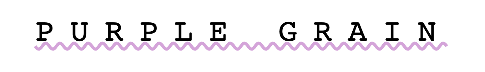

### Given Code Templetes:<br>
*index.html*
```
<!DOCTYPE html>
<html>
<head>
    <title>Hipster Logo</title>
    <link href="app.css">
</head>
<body>
    <h1>Purple Grain</h1>
</body>
</html>
```
*app.css*
```
/*YOUR CODE GOES IN HERE*/
```

## Coding Exercise 9: Basic Selectors Practice
<p>It's time to get some practice with the new CSS Selectors we just learned. Without touching any of the starter HTML code in <code>index.html</code>, write CSS in <code>app.css</code> according to these rules:</p>
<ul><li><p>Give all <code>li</code> elements the text color <code>blue</code></p></li><li><p>Give all elements with the class of <code>done</code> the text color <code>grey</code></p></li><li><p>Give the element with the id <code>clear</code> a <code>red</code> background and <code>white</code> text</p></li></ul>

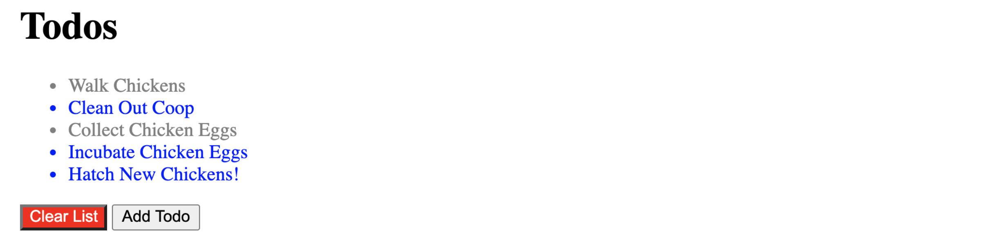

### Given Code Templetes:<br>
*index.html*
```
<h1>Todos</h1>
<ul>
  <li class="done">Walk Chickens</li>
  <li>Clean Out Coop</li>
  <li class="done">Collect Chicken Eggs</li>
  <li>Incubate Chicken Eggs</li>
  <li>Hatch New Chickens!</li>
</ul>
<button id="clear">Clear List</button>
<button>Add Todo</button>
```

*app.css*
```
/* Make all LI's blue */

/* Make everything with the class of 'done' grey*/

/* Make the element with the id of 'clear' have a red BG and white text */

```

## Coding Exercise 10: Descendant Combinator Practice

<p>Using what we just learned about the descendent combinator, write styles in app.css to accomplish the following: </p>

<p><strong>(don't change any markup in index.html, please!)</strong></p>

<ul><li><p>Give <strong>only the links in the header</strong> :</p><ul><li><p>font size of 30px</p></li><li><p>color of teal</p></li></ul></li><li><p>Give <strong>only the links inside the paragraph with the id 'dislikes':</strong></p><ul><li><p>bolded</p></li><li><p>color of red</p></li></ul></li></ul>

<p>Your result should look like this:</p>


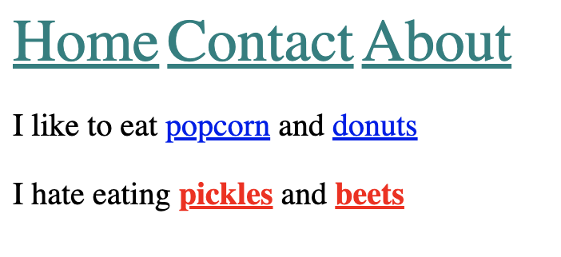

### Given Code Templetes:<br>
*index.html*
```
<!--DON'T CHANGE THIS FILE (PLEASE!)-->
<header>
  <a href="/home">Home</a>
  <a href="/contact">Contact</a>
  <a href="/about">About</a>
</header>

<p>
  I like to eat <a href="/popcorn">popcorn</a> and <a href="/donuts">donuts</a>
</p>

<p id="dislikes">
  I hate eating <a href="/pickles">pickles</a> and <a href="/beets">beets</a>
</p>
```

*app.css*
```

```

## Coding Exercise 11: Checkerboard Exercise

<p>The <code>index.html</code> file contains 25 <code>&lt;div&gt;</code> elements, each with the class of <code>square</code>. Please create a simple checkerboard pattern by making the <strong>even squares black </strong>and the <strong>odd squares red</strong>.&nbsp; Your result should look like the image below.&nbsp; Please write your styles in app.css, and do not change any of the styles in <code>NO_TOUCHING.css</code> :) <br><br><strong>Please note: </strong>the solution needs to select both the <em>even</em> and <em>odd</em> squares, changing the background color of the entire board will work visually, but will not pass the exercise parameters.</p>


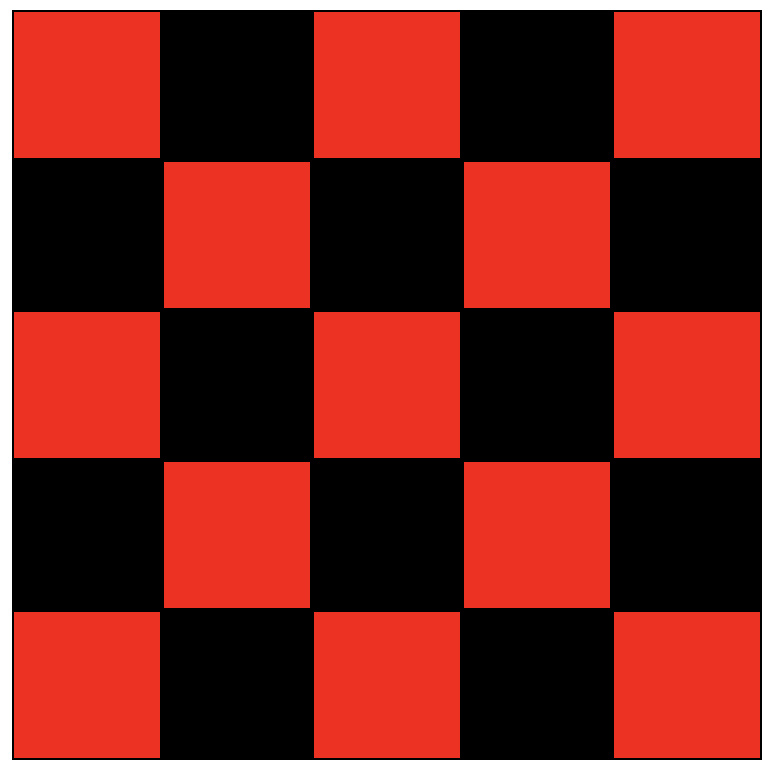

### Given Code Templetes:<br>
*index.html*
```
<!--DON'T TOUCH ANYTHING IN THIS FILE!-->
<!doctype html>

<html>
<head>

  <title>Checkerboard</title>
  <link rel="stylesheet" href="NO_TOUCHING.css">
  <link rel="stylesheet" href="app.css">

</head>

<body>
    <!--DON'T TOUCH ANYTHING IN THIS FILE!-->
    <div id="board">
      <div class="square"></div>
      <div class="square"></div>
      <div class="square"></div>
      <div class="square"></div>
      <div class="square"></div>
      <div class="square"></div>
      <div class="square"></div>
      <div class="square"></div>
      <div class="square"></div>
      <div class="square"></div>
      <div class="square"></div>
      <div class="square"></div>
      <div class="square"></div>
      <div class="square"></div>
      <div class="square"></div>
      <div class="square"></div>
      <div class="square"></div>
      <div class="square"></div>
      <div class="square"></div>
      <div class="square"></div>
      <div class="square"></div>
      <div class="square"></div>
      <div class="square"></div>
      <div class="square"></div>
      <div class="square"></div>
    </div>
</body>
</html>
```

*NO_TOUCHING.css*
```
/* DO NOT TOUCH THIS FILE!!!  */
.square {
  width: 100px;
  height: 100px;
  box-sizing: border-box;
  border: 1px solid black;
}
/* DO NOT TOUCH THIS FILE!!!  */
/* THIS CODE WILL MAKE SENSE ONCE WE COVER FLEXBOX!  */
#board {
  display: flex;
  margin: 0 auto;
  width: 500px;
  flex-wrap: wrap;
}
/* DO NOT TOUCH THIS FILE!!!  */
```

*app.css*
```
/* WRITE YOUR CODE IN HERE!!!!  */

```

## Coding Exercise 12: Box Model Practice

<p>Using what we just learned about the box model, width/height, and border...Add some styles to the <code>app.css</code> file to recreate the following image: <strong>(scroll down for specific instructions)</strong></p>

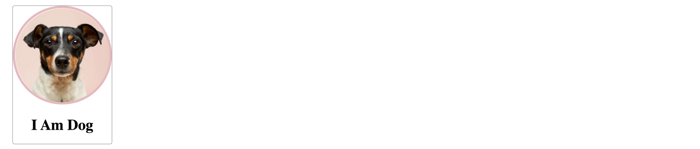

<p>Apply the following styles:</p>

<ul><li><p>The card div</p><ul><li><p>210px width</p></li><li><p>1px grey border (solid border-style)</p></li><li><p>5px border radius</p></li><li><p>center text aligned</p></li></ul></li><li><p>The image</p><ul><li><p>200px wide</p></li><li><p>5px border with color of rgb(236, 183, 191) (solid border-style)</p></li><li><p>50% border radius</p></li></ul></li></ul>


### Given Code Templetes:<br>
*index.html*
```
<!--YOU DON'T NEED TO TOUCH THE MARKUP!-->
<div class="card">
  
  <h1>I Am Dog</h1>
</div>

```

*app.css*
```
/* YOUR CODE GOES IN HERE */
```

## Coding Exercise 13: Bootstrap Basics Practice

<p>I've given you some starter markup in index.html.&nbsp; Bootstrap is already included! Please add in the appropriate bootstrap classes according to these instructions:</p>

<ul><li><p>Make the section a bootstrap container</p></li><li><p>Give the h1 white text, a dark background, and center-aligned text</p></li><li><p>Make the div an alert ('warning' color).&nbsp; Set the role attribute to alert, for accessibility purposes!</p></li><li><p>Make the first button a green bootstrap button</p></li><li><p>Make the second button a red bootstrap button</p></li></ul>

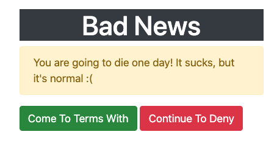

### Given Code Templetes:<br>
*index.html*
```
<!DOCTYPE html>
<html>
<head>
    <title>Bootstrap Buttons Exercise</title>
    <!--INCLUDING BOOTSTRAP-->
    <link rel="stylesheet" href="https://stackpath.bootstrapcdn.com/bootstrap/4.5.2/css/bootstrap.min.css" integrity="sha384-JcKb8q3iqJ61gNV9KGb8thSsNjpSL0n8PARn9HuZOnIxN0hoP+VmmDGMN5t9UJ0Z" crossorigin="anonymous">

</head>
<body>
    <section>
      <h1>Bad News</h1>
      
      <div>
        You are going to die one day! It sucks, but it's normal :( 
      </div>
      
      <button>Come To Terms With</button>
      <button>Continue To Deny</button>
      
    </section>
</body>
</html>


```

##Coding Exercise 14: Bootstrap Grid Practice

<p>Please recreate the layout pictured below.&nbsp; I've included bootstrap for you, but you'll need to create all the relevant markup (container, row, column, etc.). I'm not testing your code for the specific colors, but I recommend giving the columns background colors so that you can differentiate them.&nbsp; I'm also not testing for the specific text in each column. </p>

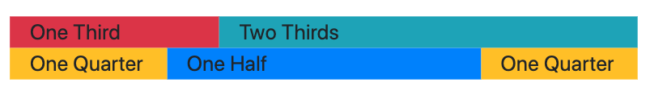

<p><strong>Please note:</strong> Although bootstrap will allow you to use col without a column size to automatically fill the remaining space in the row (and that would normally be an acceptable solution), the tests for this exercise will not recognize that as a correct solution. So, please be sure to explicitly include the column size for each individual col-* class.</p>


### Given Code Templetes:<br>
*index.html*
```
<!DOCTYPE html>
<html>
<head>
    <title>Bootstrap Grid Exercise</title>
    <!--INCLUDING BOOTSTRAP-->
    <link rel="stylesheet" href="https://stackpath.bootstrapcdn.com/bootstrap/4.5.2/css/bootstrap.min.css" integrity="sha384-JcKb8q3iqJ61gNV9KGb8thSsNjpSL0n8PARn9HuZOnIxN0hoP+VmmDGMN5t9UJ0Z" crossorigin="anonymous">

</head>
<body>
    <!--Your Code Goes Here-->
</body>
</html>


```
# Comming Soon...